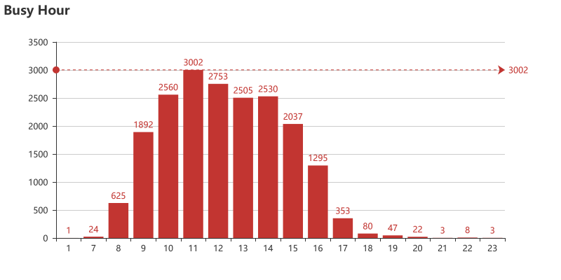
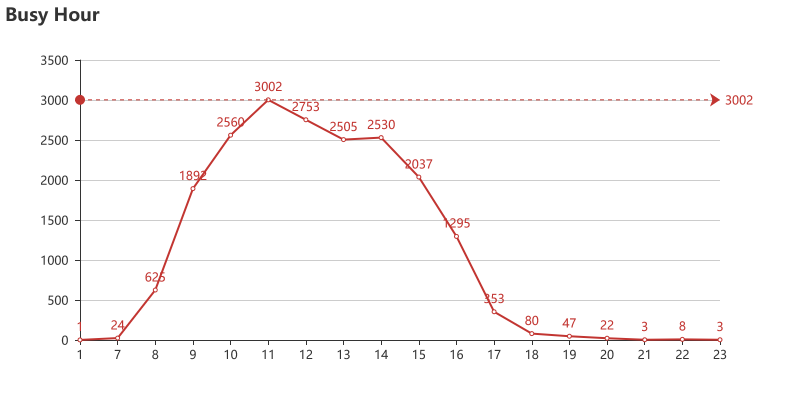
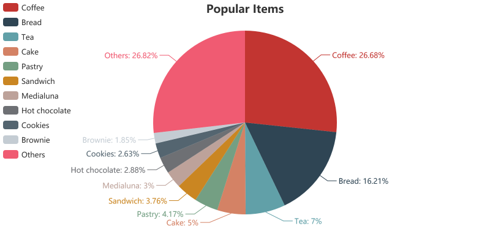
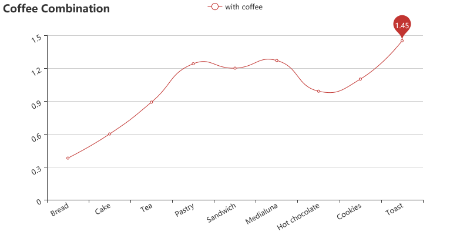
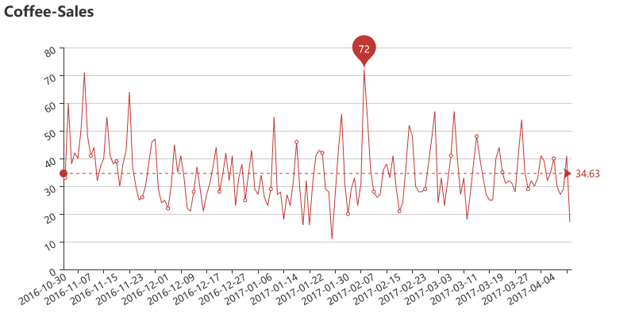

# Read the data😂

<table border="1" class="dataframe">
  <thead>
    <tr style="text-align: right;">
      <th></th>
      <th>Date</th>
      <th>Time</th>
      <th>Transaction</th>
      <th>Item</th>
    </tr>
  </thead>
  <tbody>
    <tr>
      <th>0</th>
      <td>2016-10-30</td>
      <td>09:58:11</td>
      <td>1</td>
      <td>Bread</td>
    </tr>
    <tr>
      <th>1</th>
      <td>2016-10-30</td>
      <td>10:05:34</td>
      <td>2</td>
      <td>Scandinavian</td>
    </tr>
    <tr>
      <th>2</th>
      <td>2016-10-30</td>
      <td>10:05:34</td>
      <td>2</td>
      <td>Scandinavian</td>
    </tr>
    <tr>
      <th>3</th>
      <td>2016-10-30</td>
      <td>10:07:57</td>
      <td>3</td>
      <td>Hot chocolate</td>
    </tr>
    <tr>
      <th>4</th>
      <td>2016-10-30</td>
      <td>10:07:57</td>
      <td>3</td>
      <td>Jam</td>
    </tr>
  </tbody>
</table>

---

# Clead the data😥

# Extract Hour & insert into column😀

<table border="1" class="dataframe">
  <thead>
    <tr style="text-align: right;">
      <th></th>
      <th>Date</th>
      <th>Time</th>
      <th>Hour</th>
      <th>Transaction</th>
      <th>Item</th>
    </tr>
  </thead>
  <tbody>
    <tr>
      <th>0</th>
      <td>2016-10-30</td>
      <td>09:58:11</td>
      <td>09</td>
      <td>1</td>
      <td>Bread</td>
    </tr>
    <tr>
      <th>1</th>
      <td>2016-10-30</td>
      <td>10:05:34</td>
      <td>10</td>
      <td>2</td>
      <td>Scandinavian</td>
    </tr>
    <tr>
      <th>2</th>
      <td>2016-10-30</td>
      <td>10:05:34</td>
      <td>10</td>
      <td>2</td>
      <td>Scandinavian</td>
    </tr>
    <tr>
      <th>3</th>
      <td>2016-10-30</td>
      <td>10:07:57</td>
      <td>10</td>
      <td>3</td>
      <td>Hot chocolate</td>
    </tr>
    <tr>
      <th>4</th>
      <td>2016-10-30</td>
      <td>10:07:57</td>
      <td>10</td>
      <td>3</td>
      <td>Jam</td>
    </tr>
  </tbody>
</table>

---

# Analysis methods😀

- **Busy Hours Analysis**
- **Popular Items Analysis**
- **Transaction Analysis**
- **Predict Coffee Sales**

---

# Busy Hours Analysis

## Busy Hour Bar Chart

- Busy Hours start at **10a.m.** ,end at **14p.m.**

---

# Popular Items Analysis

### TOP 10

    Coffee           5471
    Bread            3325
    Tea              1435
    Cake             1025
    Pastry            856
    Sandwich          771
    Medialuna         616
    Hot chocolate     590
    Cookies           540
    Brownie           379
    Others           5499
    dtype: int64

## Popular Items Pie Chart

- Apperently, **Coffee** is the most popular and the **bread** is second.

---

# Transaction Combination Analysis

## Coffee Combination Line Chart

- Clearly, customers are most likely to buy **toast** with **coffee**
- Customers don't like **bread**/**Cake** plus **coffee** combine

---

# Predict Coffee Sales

